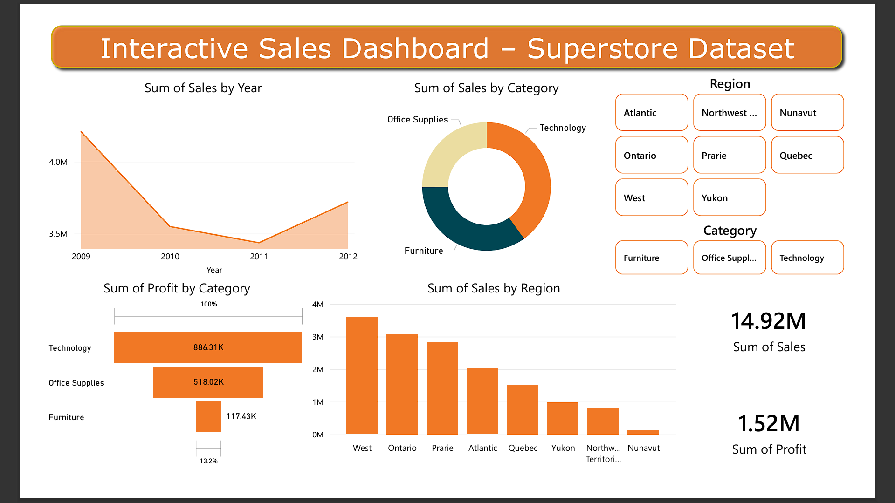

# 📊 Superstore Sales Dashboard

A clean and interactive Power BI dashboard visualizing sales trends, profit margins, and regional performance using the Superstore dataset.

---

## 🧰 Tools Used
- **Power BI** – for dashboard creation and visual analytics
- **Python (Pandas)** – for data cleaning and preprocessing
- **GitHub** – for task submission and version control

---

## 📁 Dataset
- `Superstore-Sales.csv`
  - Columns: Order Date, Region, Product Category, Sales, Profit, etc.
  - Cleaned with Python and exported as `Cleaned_Superstore_Sales.csv`

---

## 📈 Dashboard Features

| Visual | Description |
|--------|-------------|
| 📉 **Line Chart** | Sales trend over time (Month-Year) |
| 📊 **Bar Chart** | Sales by Region |
| 🍩 **Donut Chart** | Sales by Product Category |
| 🎛️ **Slicer** | Interactive filters by Region and Category |

All visuals are color-coded to emphasize top-performing segments.

---

## 💡 Key Insights

1. ✅ **The West region** consistently led in sales across all quarters, peaking in **November**.
2. 💻 **Technology category** outperformed Furniture and Office Supplies in both **sales and profit margins**.
3. 📅 Sales showed a steady **upward trend in Q4**, indicating strong end-of-year performance.
4. 🔻 The **South region** had relatively lower sales and profit, suggesting potential for marketing improvements.
5. 📌 **November** recorded the **highest monthly sales**, likely driven by seasonal promotions.

---

## 📸 Screenshot

---

